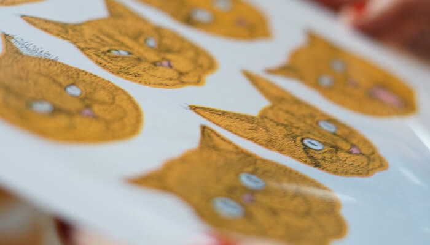
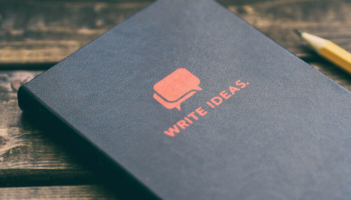
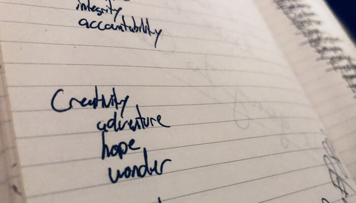
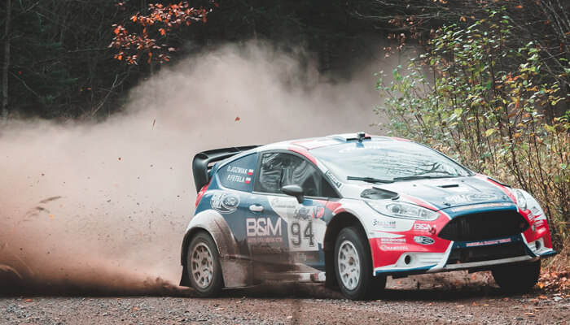

Students are the best. They teach us more about ourselves than we could have ever presumed they could. I've been repeating a simple commentary to many enthusiastic but quietly disheartened early designers for a decade when asked to critique their self-branding. "You are your toughest client." Websites, logos, flyers, business cards, resumes, and apps. Anything they're developing to show the world why they're different and better than their professional competition. All the while thinking that this self-directed branding will be what shapes their careers for the next 40 years. It's commonly an enjoyable, sometimes uncomfortable discussion, but obviously necessary to their growth.

The discussion normally yields questions in the shape of "Who do you want to work with in the future," "Where do you want to live and work in 10 years," and "Why did you start down this career path" amongst other pointed directives. Yet, here I am, astonished at the fact I never considered to take the challenge of this thought process a giant step further: Why not design your life?

## The Toughest Client You Will Ever Have

Working in an area of design for even a small amount of time, you will find that there are processes and guidelines for finding a solution or working with people that are not sure what they're after. These standardized steps help to keep businesses moving efficiently and help to make the designer seem less like a magician and more like an architect.

There are different processes for various areas of design, diverse types of people and companies, and enough to fit a variety of timelines and budgets. A favorite of mine, which I've been fortunate to be able to research, teach, and employ for years is the Design Sprint. This process is what I'll be working to implement directed and meaningful transformation in my life.

The Design Sprint's power is wielded through two main factors: Iteration and Understanding. To use it effectively in the design profession, we rely on research and user interviews to attain understanding while creating disposable prototypes to allow for fast iteration. At its core, the entire design sprint follows a basic four-step process: Idea Generation, Prototype Creation, Testing, Analyze.

Before a designer picks a single color, sets a mood, or gets excited about a typeface they'll get to use (this new version of my site was made for the sole purpose using IBM Plex, but I digress), they need to ask questions to know they're solving the right problems. Good design is the understanding and application of meaningful, pointed research. Step one, Idea Generation, is intended to find these questions by cultivating wild thinking and inventive problem-solving. At this stage, it's impossible to have a bad idea or a meaningless concept. Every inch of your creative-prowess should be brought to bear without room for doubt or self-defeating reason.

After an idea is organized enough to move forward, the next step is the creation of a disposable prototype. Disposable being the key action to focus on. We're not looking for the best, nor do we need it. This step of the process is where we'll save both time and energy by doing the absolute bare minimum that will achieve a meaningful result. For example, you want to create a new brand of cookies to sell in hip all-natural grocery stores. You need a factory to meet the demands of these stores, but you wouldn't build the factory first. You would bake a small batch, give them away to a few people, and watch for and listen to their feedback. Now, rather than creating the factory and hiring the workers to make the wrong type of cookie, you can scale your idea up in a smart and efficient way. You may even find out you've been making terrible cookies but the best dog-biscuits the world's happiest beings have ever enjoyed. Wouldn't that be wonderful?

## Where Do We Start

I'll save breaking down the Design Sprint in its entirety for another time. What's important now is understanding how this style of thinking can help each of us to move forward in a satisfying, fulfilling, and productive way. What follows is my personal experience of moving through this process.

### The Starting Line

To get moving, I decided to sit and consider what I think my values are at this point in time. Asking this question offers me a place to start as well as a way to gauge how any changes have affected me over the course of time. To do this, I grabbed a journal and a pen and got to writing words I feel I stand for. Nothing neat, just a list written as it came to mind. None of these could be wrong, it didn't matter if there were duplicates, synonyms, or antonyms, and I didn't set a time-limit.

The only restrictions I gave myself for this process were when I performed it and that it had to be written, not typed.

I purposefully waited until I was in a happy, productive, and optimistic mindset to write this list. As part of who I currently am, I fight bouts of depression and overall melancholy. Understanding this about myself was a critical piece to making this first step a success. The perfect time came to fruition when I was able to swing into a great new coffee shop riding the optimistic highs of a successful meeting with new clients about potential work.

Writing these values down in a journal allowed for a large number of positives to contribute to the process. Keeping the computer closed meant no distractions, no unexpected social-media scroll pits, and the inability to delete. There is also a fat stack of research showing that writing causes deeper connections in memory and thought which clearly made it the right tool for this step.

Taking this step alone was generously therapeutic. Having a clear understanding of how my present-day self considers himself was a strong cornerstone to lay. After a free-flowing, vanilla-caramel cold-brew fueled brainstorm, I decided to organize the list into five categories that seemed to be connections through the list:

1. **Health**: Growth, Persistence, Doing, Vitality
2. **Respect**: Timeliness, Discipline, Integrity, Accountability
3. **Creativity**: Adventure, Hope, Wonder, Courage
4. **Security**: Freedom, Strength, Control
5. **Fulfillment**: Family, Fun, Success, Service

### Time to Dream

This is my favorite part of practicing the design sprint. Letting the mind wander into the craziest futures unhindered by real-world practicality is reinvigorating to the once boundless optimism I carried. What dreams from the teenage years are still lingering? What am I missing out on in this world? What will my biggest regrets be? What type of lives am I capable of living? Who could be in my life? I can feel typing these questions has my subconscious going wild, causing a visceral feeling of hopefulness with a potential for untold amounts of joy and delight.

A future to fit what many of you would consider wild and unrealistic but always at the top of my list- rally driving. I've always loved the elements that rally driving has the ability to merge together. Traveling the world to see many of the most secluded, beautiful, emotionally engrossing areas humankind has the privilege to surround themselves within. The adrenaline-fueled, focused courage balanced by practiced skill and painstaking preparations. The sounds, smells, and trust of engineering contrasted by the solitude and merciless brutality of nature. The deep-bonded brotherhood between a driver, co-driver, and the engineers. Rally driving sounds like the most complete human experience possible in the modern world.

### Ready, Steady, Go

Let's take a pause here and begin the process. Make a plan for when and where you may be able to best reflect on yourself. You may thrive on the impulsiveness of trying this now, or you may require the same careful planning and considerations I did to ensure you're doing this in the best way for you.

Write one list: What do you value in the present, and what would you like to value in the future. Mix the two together. Don't worry about what's filling the page, just write it down if you think it truly matters to you. Write it down if you think it will positively shape who you want to become in the future. Write it down if it crossed your thought more than once.

Then, within a week of creating this list write down the wildest versions of your future that you would fight to have true. There are no right or wrong answers here. Nothing too practical or unrealistic. Challenge yourself to dream up five versions of what your future can be, but if you can think of 50 that's all the better.

This series of posts will be following my own experience throughout this process. I'll be sharing my thoughts on employing design thinking to your life, the outcomes of each stage of the process, and the ways I think you can practice it for yourself. Staying true to the design sprint concept, there will be many ideas and concepts that are shared, tried, then ultimately discarded. This will force a lifestyle of new experiences, learned knowledge, and growth in character. Which, I suppose, makes it a guaranteed success.
