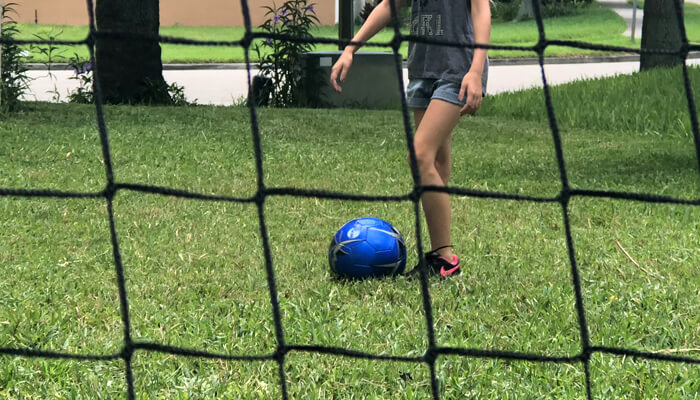

The World Cup brings to my life an incredible joy every four years. It also offers an interesting moment to consider how life has changed over the last cycle of international play. During the 2014 games, I was single and living in a pool house with all the time in the world to exercise, cook full & healthy meals for myself, and enjoy athletic activities at my leisure. This time I'm a bonus dad to three girls negotiating levels of cheese covered carbs, balancing schedules, and in serious lack of real competitive sporting.

It's taken some time to adapt, but I'm finally finding ways to bring fitness back into this frenetic life. It's taken strong efforts in prioritization, compromise, and a bit of creativity to find the moments and the right activities to regain a sense of fun fitness in my lifestyle.

## I Love the World Cup

In 2014, I was the typical American soccer fan. I watched the world cup, tried to sound like I knew what I was talking about based on my time playing in High School, and used it as an excuse to throw mid-day, alcohol-fueled pool parties.

Then Dailey Blind sent in that long, high-curling ball to Robin Van Persie in full sprint. The diving header Robin played at the end of Blind's pass was a vision of the incredible magic brought to the stage of World Cup play. Instantaneously, I fell back in love with this beautiful game. Thank you, Blind and Robin, for relighting my passion for the sport.

For the last four years, I've been obsessed with Manchester United. Awkwardly, if you follow Premier League football, you'll know this has been a tumultuous time in United's history. For the better, my love of the club has only grown stronger season over clumsy season. I watched as Van Persie was pushed out when his form took a dip. I witnessed Shaw's horrific leg injury put expectations on pause. Wayne Rooney, the face of modern United, became the all-time top scorer for the club and is now in the MLS with Schweinsteiger and Ibrahimovic. After all of this, I'm more passionate about the club and excited about its future than I have been for the past 4 years due to one big reason- Romelu Lukaku.

## World Cup 2018

It's the Quarter Finals of the 2018 World Cup. Tournament favorites Brazil are playing to a raucous crowd, easily confusing the Russian stadium's atmosphere for a home match. The opponents, Belgium, have been absorbing attack after attack and look to be running out of the barrels of luck keeping them in the match thus far. Belgium's defense is fighting. They're putting in top efforts, but being matched against Brazil's forwards is going to push any team's limits. Brazil has already had four clear chances on net and can only blame themselves for not having the points. Courtois has put in what may be his biggest career performance, absorbing Brazils every on-target effort. Belgium, however, has been using their firepower up top to scorching effect. Romelu Lukaku, Kevin de Bryune, and Eden Hazard are wreaking havoc on Brazil's high defensive line. Later in the match, Brazil will find a way to deal with this strategy, but till then this is Lukaku's show to run.

Lukaku has shown the world this tournament what many Manchester fans already know, he's going to be one of the best to play the game. He will match the greats with goals and assists, but that's not why he's so inspiring to watch. It's his unselfish, team-oriented, physical play that separates him from the pack. When Lukaku is on the ball this World Cup, you can feel the electricity in the air because something great is in the near future. The mentality, the physicality, the class, and the support he offers others makes him the ultimate athlete. He burns with a passion to win and will do the work to win. Sad that it's become something of a joke to many United fans, but to watch as Lukaku celebrates his teammates' goals with more fury than his own explains everything you need to know about this future Captain.

## Build Momentum with Mentality

I wouldn't hold it against any defender if they confuse Lukaku for Juggernaught when he's bearing down on them at full sprint. To have that speed and power of someone his size is a testament to his determined work ethic and drive to be the best. [Read this article at The Players Tribune](https://www.theplayerstribune.com/en-us/articles/romelu-lukaku-ive-got-some-things-to-say) to really understand Lukaku's mission.

Let's take this colossal motivation and do something with it. Fitness to me needs to have three things to be effective: Fun, Purpose, and Practicality. These, combined with the inspirational work ethic of Lukaku, make my baseline for deciding what action I'll take in my fitness routines.

### Running is Boring

I hate it. Running is monotonous, bordering on torturous work. Explains why I played Keeper and Central Defense when I played. Knowing this, it's high on my list of priorities. Endurance and sustained energy are two of the most practical indicators of fitness for myself. I don't need to run a marathon, but I'd like to be able to handle sprints after an hour of high-effort play. I'm about to drop all of my motivation-through-design knowledge on myself and get myself to this goal. Here's my plan for beating the tedium of running:

1. *Play with the kids*

All of these kids won't stop growing. At least now they're big enough to kick the ball around! We spend 30-60 minutes every day playing and "practicing" now. If I can only fit one thing in each day, it's this.

2. *Stay Outside*

What sounds more boring than running for 10, 20, 30 minutes? Running staring at the same wall for 10, 20, 30 minutes. I've had to shift my sleep schedule to get my run in before the Florida heat and humidity settle in, but I have noticed many benefits to adding a morning run to the routine. Want to be run-friends on Nike Run Club? Send me a tweet and I'll add you!

3. *Small-stepped goals*

My mile is just under 11 minutes currently. When I get 1 mile down to 9 minutes, I'll start running 2. No need to run a marathon or even a 5k yet, aiming too high will only cause unnecessary frustrations, injury, and disappointment.

4. *HIIT and Soccer Drills*

This has been my favorite addition yet. While I'm playing with the kids, I'll set up "drills" for them, then take part myself, too. It keeps them energized, I get a workout in, and they're starting to think of all this as play rather than a chore. Glad I held onto those cones from all those years ago.

### Power House

What I do love, is strength conditioning. In soccer, having the strength to hold off a pressing defender after sprinting up and down the pitch is an outstanding asset to have in your wheelhouse. There are countless variations of exercises to perform to build leg strength. You don't need a gym, but I'll be describing my routines which utilize my access to gym equipment. To warm up a lower body exercise, I'll pick two or three of these lunge variations:

1. Jump Squats
2. Standing Lunge
3. Clock Lunge
4. Split Lunge Jump
5. Walking Lunge

These lunges directly impact the leg muscles athletes need for strength, power, explosiveness, and injury resistance. Also, performing them properly will help to increase knee and leg joint health. My knees can use all the help they can get so after lunges, I'll focus on knee health with a few of these movements:

1. Lying Leg Raises
2. Prone Straight Leg Raises
3. Supermans
4. Lateral Lunge
5. Wipers

Now that my legs know it's time to work, I can move on to strength training. Leg day has always been my favorite within the standard workout routines because the options are so limitless, but the basics are powerful. A starting leg strength training day will typically follow this plan. Unlike the others, I'll do everything on this list:

1. Back or Front Squat
2. Romanian Deadlift
3. Bulgarian Split Squat
4. Leg Press
5. Hip Thrust
6. Calf Raises
7. Jump Squats

If you're going to be running, pivoting, taking shots, sending long passes, holding defenders off, and pushing attackers off the ball you're going to need the upper body strength to withstand all of this. Most importantly, your trunk, your abdominal and back muscles, need to be strong enough to effectively use your strength and resilient enough to keep your endurance levels high. Without this core strength, you'll be working to keep your body upright, draining your energy and making you ineffective on the ball. I'll add one or two of these on strength conditioning days or perform all on days out of the gym:

1. Lying Leg Raises
2. Flat Plank
3. Side Plank
5. Walking Side Plank
4. Quadruped Opposite arm/leg
5. Medicine Ball Overhead Throws
6. Medicine Ball Side Throws
7. Seated Russian Medicine Ball Twist

To maintain a healthy balance, arms, shoulders, and chest should still be targetted. In addition to balance, increasing the strength in these areas will make your sprinting, body blocking, and even your shots more powerful. It's important to understand that explosive strength comes from your entire body, not a single muscle group. These workouts are normally grouped into two routines based on pushing and pulling movements. One day for push, another day for pull:

#### Push

1. Flat Chest Press
2. Incline Dumbbell Press
3. Standing Military Press
4. Wide-Grip Upright Rows
5. Dips
6. Lateral Raise
7. Cable Pushdown

#### Pull

1. Deadlift
2. Pull Ups
3. Bent Over Rows
4. Lat Pull-Down
5. Rear Delt Flye
6. Bicep Dumbbell Curl
7. Cable Crunch

## All Together Now

This type of training would work on a schedule such as this:

- *Monday:* Legs
- *Tuesday:* Outdoor training, trunk, and joint health
- *Wednesday:* Push
- *Thursday:* Outdoor training, trunk, and joint health
- *Friday:* Pull
- *Saturday and Sunday:* Active Rest

This schedule gives your body time to rest the areas you've worked while allowing you to stay active and consistent with your efforts. Don't work through pain, don't skip out on sleep and actual rest, and make sure to eat in a way that fits your energy requirements.
