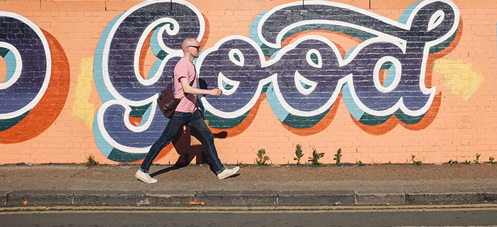

>This is Part 2 of a small series on how to improve your life
>with only a few small changes.
>[Read Part 1-Sleep here](../yourfirststeps-part1/)

## Get Up and Move

Now that you’re rested, it’s time to use all of that new found energy. Let’s take a look at where you most likely stand on the activity scale right now. Well, that’s odd, it says you’re sitting.

Did you know that most Americans will walk less than 1 mile per day? Think about this, in roughly 16 hours of conscious time you have managed to not sit at a desk, in a car, or otherwise be stationary for more than 1 mile. Starting to see why your body doesn’t feel great?

Moving is what our bodies are made to do. Everything we have evolved to overcome and specialize in has been in the name of movement. In our modern culture, there isn’t the same impetus as chasing down your family’s next meal while carrying your world on your back.

## It Takes Moves to Solve Problems

Many of today’s health epidemics, such as obesity and diabetes, are being maximized by stationary lifestyles. Our body relies on movement as an indicator of what systems are necessary, and which can be turned off to allow for efficiencies in other areas. Use it or lose it is the basic rule our bodies run on. You sit all day and have no need to move other than walking to the corner store for lunch? Then let’s reduce the capacity of your lungs, heart, and cardiovascular system. We don’t need it! You don’t have a chance at running into some weird bug, getting cut by a sharp bush, or breaking an ankle on a run? Let’s lower the energy in your immune system, you’re safe right where you are!

The Human body is incredible at adapting to the environment surrounding it. Look at how we’ve managed to spread around the world and stay relatively alike. Unlike every other member of the animal kingdom, we didn’t become full-blown specialists. We’re able to adapt, to be the best generalists the earth has ever seen and are thriving for it.

We all need to move, your quality of life depends on it. We don’t all need to be athletes or feel the pressure to exercise that social media pushes on many of us. We just need to move. You don’t need a reason. You don’t need a goal. You only need to get moving. Get up and walk for 10 minutes, then come back to this article.

How do you feel? Re-energized? Accomplished? Maybe a little sweaty and sore? Fantastic.

Try 15 minutes tomorrow and take note of how you feel after.

#### Basic Tactics to get moving more:
* Consistency: Find a time in your day that you feel low on energy, usually reach for a sugar-filled snack or another cup of coffee. Before you think about taking a nap, go for that walk, do ten pushups, maybe find a yoga routine that can get you moving in ways you normally don’t. Whatever you do, stay consistent with your time. Your body is an amazing machine, but it’s also easy to trick. Instead of dreading the afternoon
* Don’t swing for the fences: Start small. Walk a mile before you run a mile. Do basic stretches before you jump into yoga. Stay above water before you start lapping the pool.
* Build it in: Fit movement into your busy day. Many people skip the elevator and take the stairs. If you’re able, walk to the local coffee shop in the afternoon instead of reaching for your office or home-brewed cup. Take the kids outside and play a game of soccer with them, but actually play with them!
* Get addicted: After every session, no matter how hard, easy, or sweat inducing, tell yourself it was worth it. Mentally train your body to love movement. Be proud of your accomplishments, no matter how big or small they are. They’re your accomplishments to use as fuel to power the next. Your brain is magic, but it can still be tricked.
* Hydrate: Drink your water, and lots of it. Don’t reach for sugar-filled juices and sports drinks. Straight, plain-ol’ water is the treat your body wants after any workout. However, there are many studies showing that your body craves minerals after losing them to sweat and energy creation for workouts, so grab some mineral water if you can!
